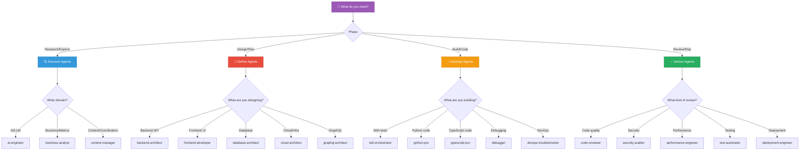

# Agent Decision Tree

> *When your brain says "which tentacle?!" - follow the flowchart.* 🐙

## Interactive Decision Trees

### By Development Phase (Double Diamond)



---

## Text-Based Quick Reference

### The 3-Question Method

**Question 1: What phase are you in?**

```
Research/Explore → Discover tentacles
Design/Plan     → Define tentacles
Build/Code      → Develop tentacles
Review/Ship     → Deliver tentacles
```

---

## The "Just Tell Me" Cheat Sheet

| If you're thinking... | Use this tentacle |
|-----------------------|-------------------|
| "I need to design an API" | `backend-architect` |
| "Something's broken" | `debugger` |
| "Is this secure?" | `security-auditor` |
| "Review my code" | `code-reviewer` |
| "I want TDD" | `tdd-orchestrator` |

---

## When In Doubt

**Just describe what you need!** Multipowers auto-routes based on keywords:

**Or use a workflow skill:**

| Skill | Does What |
|-------|-----------|
| `/mp:review` | Fast code review (deliver workflow) |
| `/mp:discover` | Deep research (multi-perspective discovery) |
| `/mp:embrace` | Full 4-phase Double Diamond workflow |

---

<p align="center">
  🐙 <em>"Eight tentacles, one goal: picking the right one for YOU."</em> 🐙
</p>
